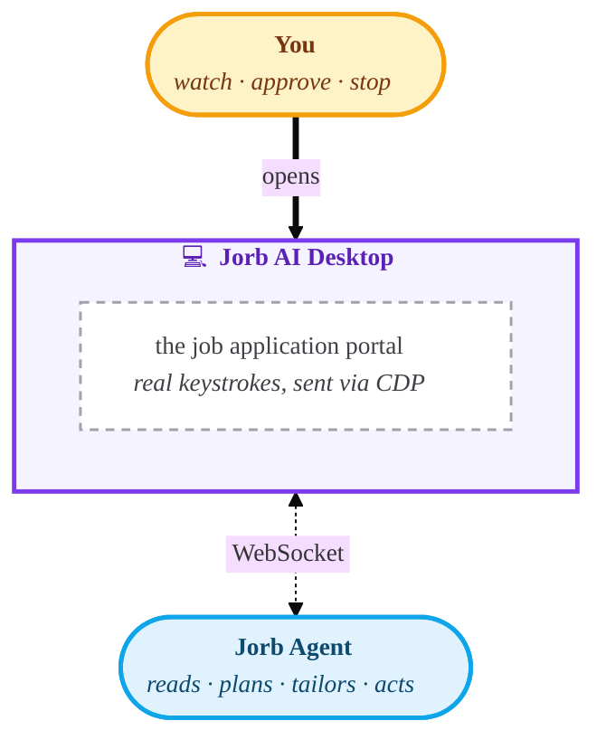

# CLAUDE.md

Orientation for agents and humans working in this repository. Public-facing pitch lives in [`README.md`](./README.md); this file is the engineering reference.

## 60-Second Briefing

- **Identity:** Electron desktop app that automates job applications via Chrome DevTools Protocol. A dumb terminal: zero business logic, zero direct Supabase, zero Realtime.
- **Stack:** Electron + TypeScript + React (Vite HMR). One BrowserWindow with a floating sidebar plus an adaptive action bar above a flush-white middle panel.
- **Role:** Layer 1 shell. All intelligence lives in `web-api/` (the Python brain). The embedded `web-app` renders inside a BrowserView as Layer 2 (peer app). Communication is a SINGLE WebSocket. CDP, navigate, file sync, panel switch, and pubsub data all ride it.
- **Critical contract:** `MAX_BROWSER_JOB_SESSIONS` here MUST equal `MAX_CONCURRENT_BROWSER_JOBS` in `web-api/finbroapi/src/browser_worker/main.py` (see `workstreams/browser/contracts.md` C9).
- **Next read:** `workstreams/browser/` (workstream.md, architecture.md, handoff.md) in the HQ monorepo for system-wide architecture. This file is the visual-language plus source-structure reference.

## Branch Policy

Work on `main` only. No feature branches. Commits land directly on `main` with clear per-change messages and are pushed immediately. See the org-wide rule in HQ's `CLAUDE.md`.

## What This Is

Electron desktop app that automates job applications via Chrome DevTools Protocol. The app is a **dumb terminal**, with zero business logic, zero direct Supabase access, and zero Supabase Realtime. All intelligence lives in `web-api/`. The shell executes CDP commands, renders the browser, and streams activity over a single WebSocket.

For the full system architecture, read the HQ workstream:

- `workstreams/browser/workstream.md` for the entry point and current invariants
- `workstreams/browser/architecture.md` for the full system architecture
- `workstreams/browser/files.md` for the exhaustive cross-repo file map
- `workstreams/browser/contracts.md` for cross-repo couplings (mandatory pre-read before any cross-repo edit)
- `workstreams/browser/changelog.md` for the architectural-decisions record

## Architecture



One BrowserWindow with a floating sidebar over a flush middle. The sidebar is a 180px frosted-glass card. The middle panel is full-bleed white. The window canvas is solid white so the surface reads as one continuous space. The action bar above the browser is HIDDEN on idle and on system tabs (the BrowserView reflows to the top of the middle panel). It appears only when an agent session is the active tab, and when expanded it renders the JorbHeader (mascot video plus speech bubble).

### Dimensions

- Window background: solid white (`#FFFFFF`)
- LEFT sidebar zone: **190px** (180px frosted-glass card plus 6px L/T/B gutter and 4px R gutter, 14px radius, `backdrop-filter: blur(24px) saturate(180%)`, `rgba(255,255,255,0.72)` fill, elevated drop shadow plus a 1px subtle border for white-on-white separation)
- Middle action bar: **0 hidden / 96 JorbHeader / 122 paused_for_user** (variable)
- Browser area fills the rest

### Action-bar state machine (0 hidden / 96 JorbHeader / 122 in `paused_for_user`)

| Active tab | Height | Content |
|---|---|---|
| idle / `__webapp__` | **0** | Hidden. BrowserView fills the middle panel top-to-bottom. |
| any `__inbox_<id>__` | **96** | JorbHeader: mascot plus inbox-context speech bubble, no buttons. Speech is `"Reading your inbox right now for a verification code..."` when the EmailAgent is reading this inbox (per `inbox_status_changed.reading: true` from the server); `"I'll check your inbox for verification codes when you apply."` otherwise. |
| any agent session (`queued` / `running` / `needs_review` / `completed` / `failed` / `stopped`) | **96** | JorbHeader: 60px mascot video plus speech bubble. Only the speech line changes per state. The bubble is one constant purple. **Stop button** (existing) visible during `running` / `needs_review` / `paused_for_user`. |
| agent session in `paused_for_user` (inbox-access give_up) | **122** | JorbHeader with the longer reason-specific speech variant + the `▸ Open your inbox pre-searched…` affordance below the bubble when the event carries `gmail_search_url`. **Continue button** (new, inbox-access) visible only here, right of Stop with a 16px gap, filled primary purple. Bar grows 96 → 122 in this one state so the longer copy + affordance fit cleanly. |

Renderer notifies main of the current bar height via `window.Finbro.panel.setBarHeight(h)` (0, 96, or 122 — 122 is the paused_for_user variant). `windows.ts`'s `setActionBarHeight` re-flows `BrowserView` bounds whenever the bar height changes.

### Worker-driven navigate loads in the background

When the worker sends `navigate` over the WebSocket, `panels.ts:executeNavigate` passes `autoShow: false` to `navigateSession`. viewA is created, the URL loads, CDP attaches, but the view is NOT brought to the front. The browser-tab analogy: opening a new tab in the background while you keep working on the foreground one. The sidebar's purple gleam (via the `browser_job_inserted` pubsub push) is the user's signal that a new session exists. They click in when they want to watch.

User-initiated paths (initial `__webapp__` load on app start, sidebar system-tab clicks routed through `showOrNavigateSession`) keep `autoShow: true` (the default). `panels.ts:showSession` still fires `session:active-changed` over IPC for those user-initiated calls, and the renderer's `window.Finbro.session.onActiveChanged(cb)` listener keeps `activeJobId` in lockstep with whichever view is actually on top.

## Visual Language

Mirrors the `web-app` webapp's look and feel so the desktop shell and the webapp that runs inside its BrowserViews feel like one product.

- **Typography:** system font stack (`-apple-system, BlinkMacSystemFont, 'Segoe UI', 'Roboto', 'Helvetica Neue', Arial, sans-serif`), same as `web-app/tailwind.config.ts`. No web fonts. No Google Fonts CDN.
- **Color:** single-accent system. `primary` = `#290E99` (`finbro-purple` in the webapp) reserved for "act now" signals: the agent-live dot, the gleaming sweep on running session rows, and the JorbHeader speech bubble. NOT used for plain active-row state. Neutrals are a Tailwind-aligned gray scale (`gray-50`...`gray-900`) matching `web-app`'s actual usage. Semantic `success` / `warning` / `danger` carry the session-row status signals: a green glow (completed), an amber glow (needs-attention), a static red tint (failed), plus small marks and icons.
- **Chrome:** solid white window canvas. The sidebar is a frosted-glass card (`rgba(255,255,255,0.72)` over `backdrop-filter: blur(24px) saturate(180%)`) with an inset white-highlight plus an elevated drop shadow plus a soft 1px border so it reads as a floating object on white rather than a contrasting zone. Tight gutter (6px L/T/B plus 4px R), with almost no gray space. Middle panel is full-bleed white. Interactive rows use `rounded-md` (6px) and 28px height for compact density.
- **Active state:** subtle pill, with `gray-100` fill plus 1px `gray-200` inset ring plus `font-medium` plus `gray-900` text. Hover is `gray-50` fill. The two states share a fill family so hover feels like a precursor to active, not a competing treatment.
- **Running state:** gleaming sweep, a translucent primary gradient swept L-to-R over the row at ~2.4s ease-in-out infinite. Layers on top of the active pill if the row is also active. Runs through the tailoring sub-flow too. Stops only on a terminal status.
- **Brand:** `logo_wordmark.png` image asset in the sidebar header (48px container, logo 20px tall). No border-bottom. Breathing space below carries the separation.
- **Motion:** breathe, not flash. Live dot pulses at ~1.8s. JorbHeader speech bubble re-fires `animate-jorb-enter` (0.35s fade-up) on each new agent message. Ambient halo runs `animate-jorb-glow` (3.5s ease-in-out infinite) while running. No typewriter, no spinners.

## Browser Parity

The shell is a browser at heart, with tabs, switching, loading, closing. For any behavior it shares with a real browser, match the browser convention. Users arrive with deep Chrome and Safari muscle memory. Honour it, never fight it.

- Switching tabs is a z-order change, instant, never a reload. The tab keeps its scroll, sign-in, and form state (`showOrNavigateSession`).
- A tab loads once on first open. After that, it persists.
- Closing a tab is immediate and irreversible, and the close affordance is always reachable, every tab, every state.
- A tab that is loading, or that failed to load, says so. Never a blank or a stale page.

Becoming a general-purpose browser is not a goal (no address bar, no bookmarks). It's a constraint. For the browser-like things the shell does do, do them the browser way.

## JorbHeader

The action-bar narrative element when an agent session is running. Ported from `web-app/src/components/ui/agent/JorbHeader.tsx` to `src/renderer/components/JorbHeader.tsx` as plain React plus plain CSS (no Tailwind).

- 60x60px mascot video on the left, alpha-keyed via the global `<filter id="jorb-alpha">` declared in `index.html` (luma-weighted `feColorMatrix` keys out the video's near-black background).
- Speech bubble on the right, primary-tinted background, primary-tinted border, "Jorb" eyebrow plus the latest agent message body.
- 8 mascot videos in `src/renderer/assets/videos/jorb1.webm` through `jorb8.webm`. Picker reshuffles a deck so consecutive plays don't repeat. Hover plays the picked video once.
- Wired off the active job's events: speech derives from the latest `tool_call`'s human-readable mapping (`config.py:TOOL_NAME_MAPPING`), the latest `status` / `paused_for_tailor` / `error` message, or a default greeting on cold start.

All tokens live in `src/renderer/lib/colors.ts` with CSS-variable mirrors in `src/renderer/styles.css`. No product-specific names (no "brand", no "finbroPurple"). Generic names only.

## Source Structure

```
src/
├── main/                        Electron main process
│   ├── main.ts                  App lifecycle plus macOS re-activate hook
│   ├── logger.ts                electron-log setup (import from here)
│   ├── config.ts                electron-store config
│   ├── windows.ts               Two-panel bounds. setActionBarHeight(h)
│   │                            re-flows BrowserView bounds when the
│   │                            renderer bar toggles 0 / 96 / 122.   
│   ├── panels.ts                Multi-session BrowserView manager.
│   │                            navigateSession takes options.autoShow
│   │                            (default true). showSession fires
│   │                            session:active-changed IPC.
│   ├── websocket-client.ts      Single WS. CDP, navigate, file sync,
│   │                            file_sync_trigger, panel_switch,
│   │                            queue+flush, auto-resubscribe.
│   │                            executeNavigate passes autoShow:false.
│   ├── auth.ts                  JWT in-memory. Push-only ingress from
│   │                            the webapp via window.finbro.sendAuthToken.
│   ├── file-sync.ts             Single-round-trip download on
│   │                            file_sync_trigger (signed URL inline).
│   │                            files/ wiped on every cold start;
│   │                            no metadata.txt, no orphan-detection.
│   ├── ipc.ts                   IPC handlers: config, auth, panel
│   │                            navigate / set-bar-height, browser:stop,
│   │                            session show / show-tailor / destroy /
│   │                            status, session:active-changed channel.
│   ├── chrome-import/           Dev cookie-import (profiles / cookies /
│   │                            allowlist): in-process v10 decrypt (dev) or
│   │                            spawn-Chrome+CDP (prod), allowlist-filter,
│   │                            inject into persist:portal. See
│   │                            workstreams/browser/shell/cookie-import.md.
│   └── rpc-bridge.ts            Renderer rpc.ts <-> WS bridge with
│                                inbound (3 types) and outbound
│                                (6 push events plus error) allowlists.
│
├── preload/
│   ├── preload.ts               window.Finbro for the main renderer
│   └── preload-webview.ts       window.finbro.sendAuthToken for
│                                BrowserView auth push
│
├── renderer/                    Main React app
│   ├── app/
│   │   ├── App.tsx              Two-panel shell. Tracks activeJobId
│   │   │                        (agent session) versus activeNavId (system
│   │   │                        tab) as mutually exclusive. Listens to
│   │   │                        session.onActiveChanged.
│   │   ├── index.tsx            ReactDOM entry
│   │   └── index.html           CSP: default-src plus connect-src 'self'
│   │                            plus ws://localhost:5273 http://localhost:5273
│   │                            for Vite HMR. media-src 'self' for
│   │                            JorbHeader videos. Global SVG
│   │                            <filter id="jorb-alpha"> definition.
│   ├── panels/
│   │   ├── session-list/        Sidebar
│   │   └── action-bar/          Adaptive action bar (renders JorbHeader
│   │                            when expanded)
│   ├── components/              SessionRow, JorbHeader, SessionPlaceholder
│   ├── lib/
│   │   ├── rpc.ts               WS-backed data layer. UUID correlation,
│   │   │                        10s timeout. listBrowserJobs /
│   │   │                        subscribeBrowserJobs / watchAgentJob.
│   │   └── colors.ts            Design tokens (generic names)
│   ├── assets/                  logos/ plus videos/jorb1..8.webm
│   ├── types.ts                 BrowserJobRow, BrowserEvent,
│   │                            SessionDisplayStatus, Window.Finbro decl
│   └── styles.css               Full design system in CSS variables
│
└── types/                       Shared types (main plus preload)
    ├── config.types.ts          AppConfig: { debugMode, automationServerUrl }
    └── ipc.types.ts             IpcChannel enum (PANEL_SET_BAR_HEIGHT,
                                 SESSION_ACTIVE_CHANGED)
```

## Key Conventions

- **panels/** equals layout regions composed once in App.tsx. Never reused.
- **components/** equals shared primitives used across panels. Must be generic.
- Panel-specific sub-components live inside their panel folder.
- If a sub-component is used by 2 or more panels, promote it to components/.

## Logging

Main process uses `electron-log`. Renderer keeps `console.*` (DevTools only).

```ts
import log from './logger';

log.debug('[Module] ...');  // suppressed in production
log.info('[Module] ...');   // operational milestones
log.warn('[Module] ...');   // unexpected but non-fatal
log.error('[Module] ...');  // failures
```

Rules:

- Every log message starts with `[ModuleName]` bracket prefix.
- No emoji in log messages.
- No raw `console.*` in main-process code.
- `debug` is high-volume diagnostics (per-file downloads, CDP nav, signed URLs).
- `info` is operational milestones (startup, connection, sync complete).
- Default level: `info` in production, `debug` when `config.debugMode` is true.
- Log files: `~/Library/Logs/Jorb AI/main.log` (macOS).

## Communication

Single WebSocket is the ONE data channel between this shell and `web-api`. Everything (CDP, navigate, file upload, file sync, panel_switch, and pubsub live data) rides on that connection.

| Channel | What flows | Direction |
|---------|-----------|-----------|
| WebSocket (single) | CDP, navigate, file upload/sync, panel_switch, data-plane pubsub | Main <-> web-api |
| IPC | Panel nav, `panel:set-bar-height`, auth tokens, `browser:stop`, `session:*`, `rpc:*` | Renderer <-> Main |
| `window.Finbro` | Preload bridge for main renderer | Main <-> Renderer |
| `window.finbro` | Auth token push from webapp (in BrowserView) | BrowserView -> Main |

Supabase Realtime is NOT used by this renderer. All data (list plus live updates for `browser_jobs` and `agent_jobs`) flows over the WS via `rpc-bridge.ts` plus `rpc.ts`. See `workstreams/browser/changelog.md` 2026-04-11 "Dumb-terminal data plane" for why.

## Rules

1. No business logic in this shell. It's a dumb terminal.
2. WebSocket is the single data channel. No parallel Supabase client, no Supabase Realtime, no other external network surface.
3. Do not inject DOM into any BrowserView, with ONE sanctioned exception: the agent's transient purple "lock-on" highlight, drawn on the element about to be actuated so the user can watch the fill happen (`web-api/.../browseragent/tools.py` `_highlight_node`, via CDP `Runtime.callFunctionOn`). It must stay `pointer-events:none`, self-remove (~1.2s), use a single fixed id, and never mutate form fields. No other DOM injection; CDP isolation for viewA is otherwise preserved.
4. Do not import `@supabase/supabase-js` in the renderer. Enforced by `package.json` (no dep) and by CSP `connect-src 'self'`.
5. BrowserView partition is `persist:portal` for portal (viewA) and webapp (viewB / `__webapp__`) views, isolating cookies from the main renderer. Inbox views (`__inbox_<id>__`, one per row in `user_inboxes`) use per-inbox partitions `persist:inbox_<id>` so connected accounts are isolated from `persist:portal` and from each other. See `workstreams/browser/shell/inbox-access.md`.
6. `MAX_BROWSER_JOB_SESSIONS = 15` must equal `MAX_CONCURRENT_BROWSER_JOBS` in `web-api/finbroapi/src/browser_worker/main.py` (see `workstreams/browser/contracts.md` C9). Cap-raise rationale and the vertical-scaling tiers live in `workstreams/browser/architecture.md` "Scaling Posture".
7. Do not reintroduce a right panel. Phase 5 was a deliberate removal. Intervention signals live in the action-bar transform, and the Approve affordance lives inside the tailor page per QA R26.
8. Do not name colors after products ("brand", "finbroPurple"). Generic tokens only (`primary`, `neutral*`, `success` / `warning` / `danger`).

## Development

```bash
npm install
npm run dev        # Vite dev server (HMR for renderer) plus Electron
                   # pointing at it. Renderer changes (CSS, .tsx) update
                   # instantly with no restart. Main-process changes still
                   # require kill-and-rerun.
npm run build      # Production build (tsc main plus vite build renderer)
npm run build:once # One-shot build plus launch Electron
npm run package    # Build plus package (no distribute)
npm run dist       # Build plus distribute (.dmg / .exe)
```

### How the dev loop is wired

`vite.config.ts` runs the dev server on port 5273 (strict). `windows.ts` checks for `VITE_DEV_SERVER_URL` and, if set, calls `loadURL` against the dev server instead of `loadFile` against the built `dist/renderer/`. The `dev` script uses `concurrently` to run Vite plus Electron in the same terminal, with `wait-on tcp:5273` so Electron only launches once Vite is ready. Closing the Electron window kills the whole script (`--kill-others`).

CSS is imported as a module from `index.tsx` (`import '../styles.css'`), which is what enables Vite's HMR for stylesheet changes. Edits to `styles.css` apply without a page reload. The `<link>` tag was dropped.

The CSP in `index.html` has `ws://localhost:5273 http://localhost:5273` in `connect-src` so Vite's HMR WebSocket can connect during dev. These hosts are local-only so the production build inheriting them is harmless.

## License

[MIT](LICENSE) © 2026 Jorb AI
