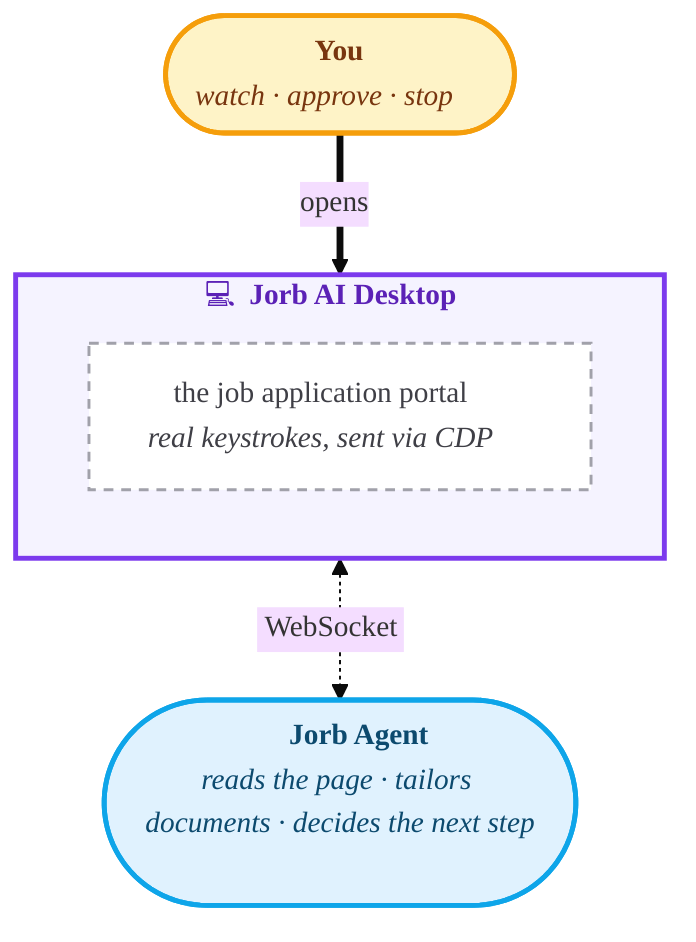

 
 

### An AI agent applies to jobs for you. You watch every keystroke.

Job applications, fully automated. Resumes and cover letters, tailored on the fly.
Yours to review, yours to approve, yours to stop whenever you want.

 

 

**[jorb.ai](https://jorb.ai)**

 

---

## How it works

The desktop app embeds the real job application page inside its own window. The Jorb agent, your AI copilot in the cloud, reads the page, decides what to type, and ships those keystrokes back over a single WebSocket. The desktop replays them through Chrome DevTools Protocol, the same channel real browsers use to drive themselves. To the application portal, every keystroke looks like a human at the keyboard.

When the agent reaches a resume or cover letter upload, it pauses, tailors the document in your voice, and waits for your explicit approval before anything gets submitted.

 

## What makes it different

🎹 &nbsp; **Real keystrokes, not JavaScript injection.**  
Most automation bots inject scripts or simulate clicks at the page level. Modern job portals detect that immediately. Jorb AI types through Chrome DevTools Protocol, the same interface real browsers use, so every input is indistinguishable from a human at the keyboard.

👀 &nbsp; **You stay in the loop.**  
Every keystroke is visible. Every tailored document is yours to review. The Stop button is always one click away. Nothing gets submitted without your eyes on it.

🔓 &nbsp; **Open. Auditable. Yours.**  
The code that runs on your computer is right here. No hidden binaries. No black box. Read it, fork it, ship it.

 

## License

[MIT](LICENSE) © 2026 Jorb AI

 

Built with care at [jorb.ai](https://jorb.ai)

